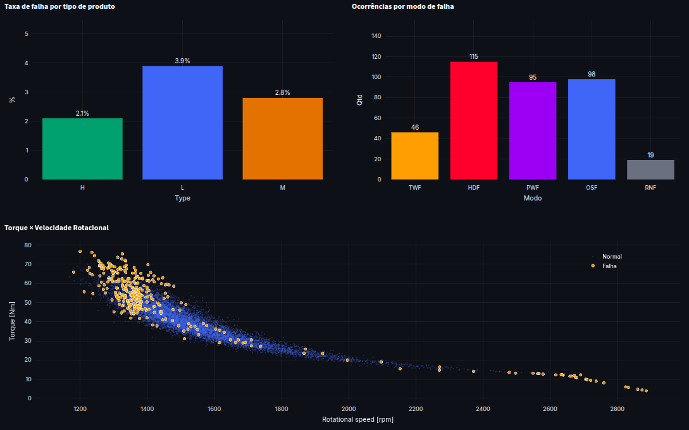
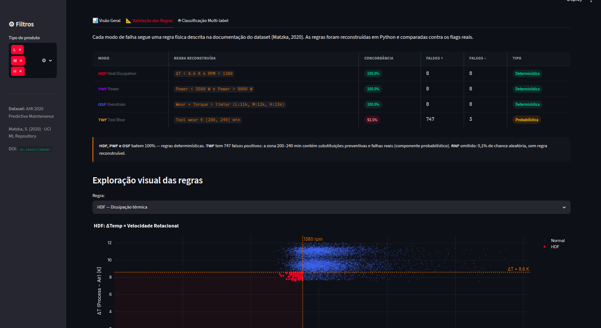
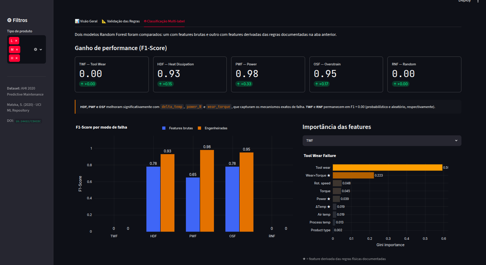

# Predictive Maintenance — AI4I 2020

A predictive maintenance study built on the AI4I 2020 dataset, combining data auditing, validation of documented failure mechanisms, domain-driven feature engineering, multi-label machine learning, and an interactive analytical dashboard.

Rather than treating the dataset as a conventional classification problem, this project starts from a different question:

> Do the documented physical failure mechanisms actually explain the observed labels?

The entire workflow was designed to validate that assumption before training predictive models.

---

## Objectives

This project pursues four goals:

1. Validate the consistency of the AI4I 2020 dataset.
2. Reconstruct and verify the physical rules that generate each failure mode.
3. Measure the impact of domain-informed feature engineering on predictive performance.
4. Provide an interactive environment for exploring failure behavior and model results.

---

## Dataset

The project uses the AI4I 2020 Predictive Maintenance Dataset, which simulates an industrial manufacturing process monitored by operational sensors.

Available process variables include:

* Air temperature
* Process temperature
* Rotational speed
* Torque
* Tool wear
* Product type

The dataset contains five failure modes:

| Code | Failure Mode             |
| ---- | ------------------------ |
| TWF  | Tool Wear Failure        |
| HDF  | Heat Dissipation Failure |
| PWF  | Power Failure            |
| OSF  | Overstrain Failure       |
| RNF  | Random Failure           |

In addition, a global `Machine failure` flag indicates whether a machine failure occurred.

---

## Project Structure

```text
predictive-maintenance/
│
├── images/
│   ├── Overview-part1.png
│   ├── Overview-part2.png
│   ├── rule-validation.png
│   └── classification.png
│
├── ai4i2020.csv
├── manutencao-preditiva.py
├── dashboard.py
└── README.md
```

---

## Phase 1 — Data Audit

The first stage focused on understanding the dataset structure and validating its integrity.

Checks performed:

* Missing value analysis
* Uniqueness validation for identifiers
* Distribution analysis of categorical variables
* Verification of documented feature ranges
* Consistency analysis between failure modes and machine failure labels

An important finding emerged during this stage:

Some records contain a machine failure without any active failure mode, while others contain a random failure without triggering machine shutdown.

These apparent inconsistencies are intentional and documented by the dataset authors.

---

## Phase 2 — Failure Mechanism Reconstruction

The documented failure mechanisms were reconstructed directly from the formulas described in the dataset documentation.

### HDF — Heat Dissipation Failure

Triggered when:

* Process temperature − Air temperature < 8.6 K
* Rotational speed < 1380 rpm

### PWF — Power Failure

Triggered when mechanical power:

* < 3500 W
* > 9000 W

Power was calculated as:

Torque × Angular Velocity

### OSF — Overstrain Failure

Triggered when:

Tool Wear × Torque

exceeds a threshold defined by product type:

| Type | Threshold |
| ---- | --------- |
| L    | 11000     |
| M    | 12000     |
| H    | 13000     |

### TWF — Tool Wear Failure

The documentation defines a wear-risk region between:

200 ≤ Tool Wear ≤ 240 minutes

However, only part of these records actually fail, introducing a probabilistic component.

### RNF — Random Failure

Random failures occur independently of process variables and therefore cannot be reconstructed through deterministic rules.

---

## Phase 3 — Feature Engineering

Three engineered features were derived directly from the reconstructed physical mechanisms:

| Feature     | Description                           |
| ----------- | ------------------------------------- |
| delta_temp  | Process Temperature − Air Temperature |
| power_W     | Mechanical power in watts             |
| wear_torque | Tool Wear × Torque                    |

The hypothesis was straightforward:

If the documented mechanisms genuinely explain the failures, models should benefit from features that explicitly encode those mechanisms.

---

## Phase 4 — Multi-Label Classification

Failure prediction was formulated as a multi-label classification problem.

Instead of predicting only machine failure, the model predicts:

* TWF
* HDF
* PWF
* OSF
* RNF

Two Random Forest pipelines were evaluated:

### Baseline Model

Original process variables only.

### Engineered Model

Original variables plus domain-engineered features.

Both models were trained using:

* Random Forest
* MultiOutputClassifier
* Balanced class weights
* Stratified train-test split

---

## Results

Feature engineering produced substantial improvements for deterministic failure modes.

| Failure Mode | F1 Baseline | F1 Engineered |
| ------------ | ----------- | ------------- |
| TWF          | 0.00        | 0.00          |
| HDF          | 0.78        | 0.93          |
| PWF          | 0.65        | 0.98          |
| OSF          | 0.78        | 0.95          |
| RNF          | 0.00        | 0.00          |

The results support the original hypothesis:

Features derived from physical mechanisms are significantly more informative than raw process variables alone.

The project also demonstrates an important limitation:

No amount of feature engineering can recover information that is inherently probabilistic (TWF) or random (RNF).

---

## Dashboard

The Streamlit dashboard consolidates the analysis into three sections.

### Overview

- Dataset summary
- Failure distributions
- Failure rates by product type
- Process variable exploration

### Rule Validation

- Visual inspection of reconstructed failure boundaries
- Agreement analysis between rules and labels
- Exploration of deterministic versus probabilistic mechanisms

### Multi-Label Classification

- F1-score comparison
- Feature importance analysis
- Performance gains from engineered features

---

## Dashboard Preview

### Overview




Summary metrics, failure distributions, and process-variable exploration.

### Rule Validation



Interactive visualization of reconstructed failure boundaries and agreement with documented rules.

### Multi-Label Classification



Comparison between baseline and engineered models, including F1-score improvements and feature importance analysis.

---

## Key Findings
---

## Key Findings

* The documented HDF, PWF and OSF mechanisms are fully reproducible.
* Domain knowledge produces larger gains than additional model complexity.
* Feature engineering significantly improves classification performance when it reflects the true physical process.
* Some failure modes contain irreducible uncertainty and cannot be reliably predicted from the available variables.
* Understanding the data generation process is often more valuable than immediately training a model.

---

## Technologies

* Python
* Pandas
* NumPy
* Scikit-Learn
* Streamlit
* Plotly
* Matplotlib

---

## Running the Project

Install dependencies:

```bash
pip install -r requirements.txt
```

Run the analytical dashboard:

```bash
streamlit run dashboard.py
```

The application will open locally in your browser and provide access to all analyses and visualizations.
